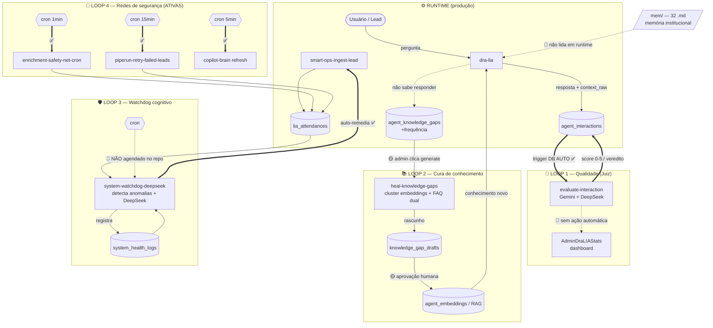

# Diagrama — Sistema Auto‑Generativo (estado atual)

> Auditoria do ciclo "detectar erro → avaliar → corrigir → memorizar".
> ✅ = elo automático e ativo · 🟡 = existe mas depende de humano · 🔴 = elo ausente/dormente

## 1. Visão de loops



## 2. Onde o ciclo quebra

```
   DETECTAR  ──►  AVALIAR  ──►  CORRIGIR  ──►  MEMORIZAR  ──►  (volta)
   ✅ forte      ✅ forte      🟡 humano      🟡 só RAG       🔴 não relê
   (judge,       (dual-model   (heal/watchdog  (mem/ é doc,    o passado
    health_logs)  consenso)     gated)          não runtime)   sozinho
```

Os 3 elos vermelhos a fechar:
1. 🔴 Watchdog sem `cron.schedule` versionado → auto‑detecção dormente.
2. 🔴 Veredito do Juiz não gera ação (só dashboard).
3. 🔴 `mem/` não é consumida em runtime (memória passiva).
