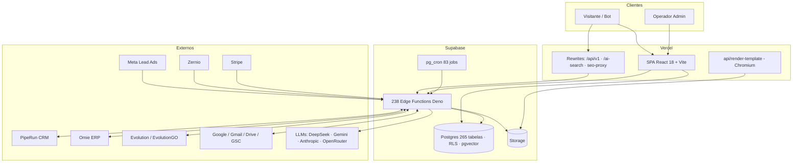
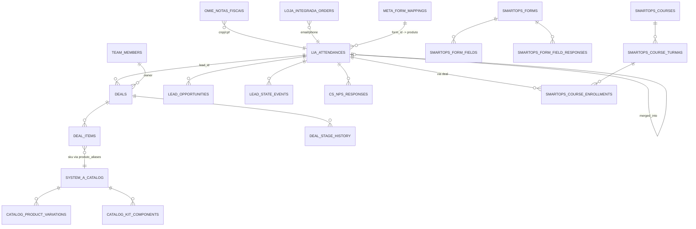
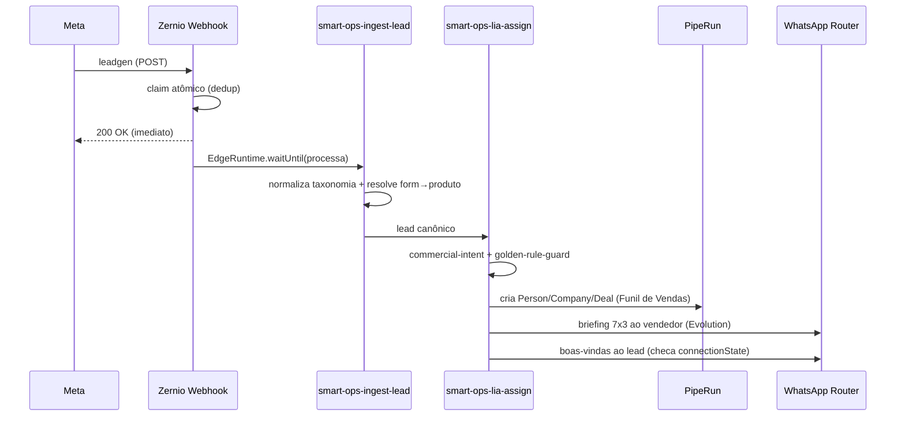
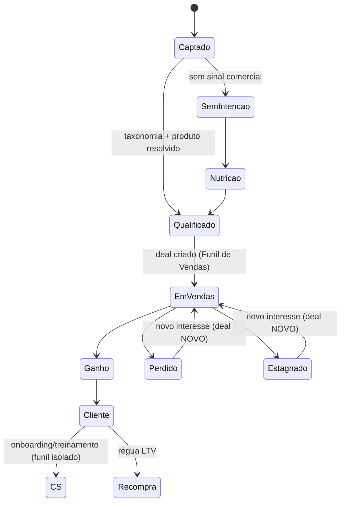
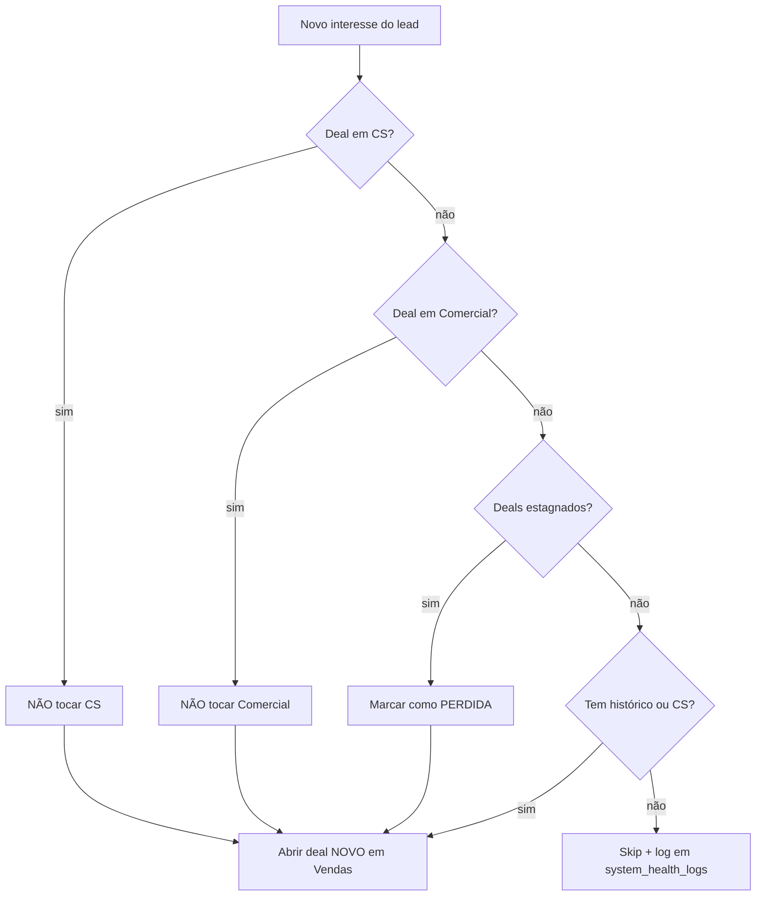
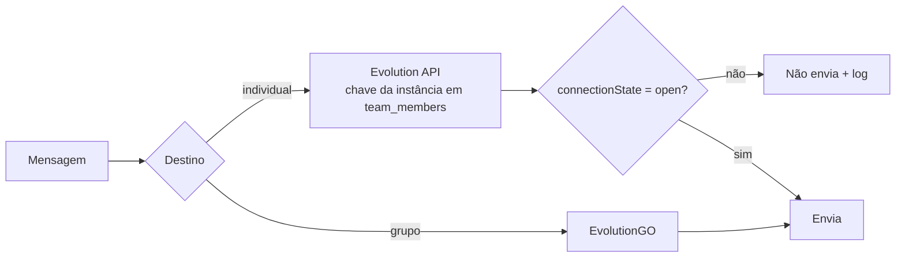

# 12 — Diagramas

## 12.1 Arquitetura geral

## 12.2 DER simplificado (núcleo)

## 12.3 Sequência — lead Meta até briefing

## 12.4 Estados do lead

## 12.5 Regra de Ouro (decisão)

## 12.6 Roteamento WhatsApp

